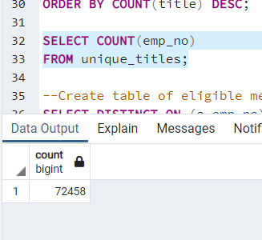
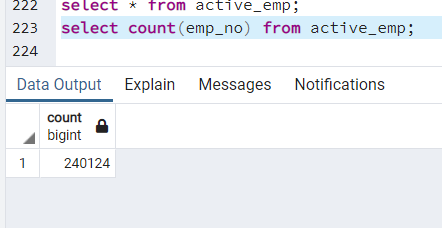
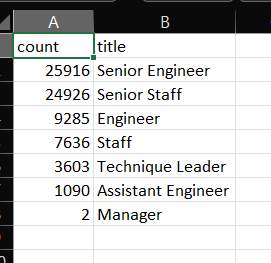
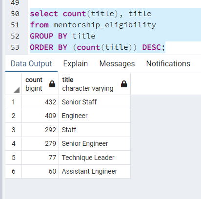
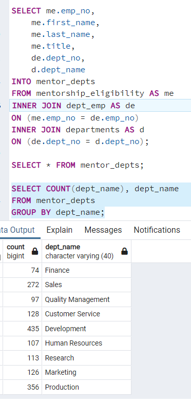
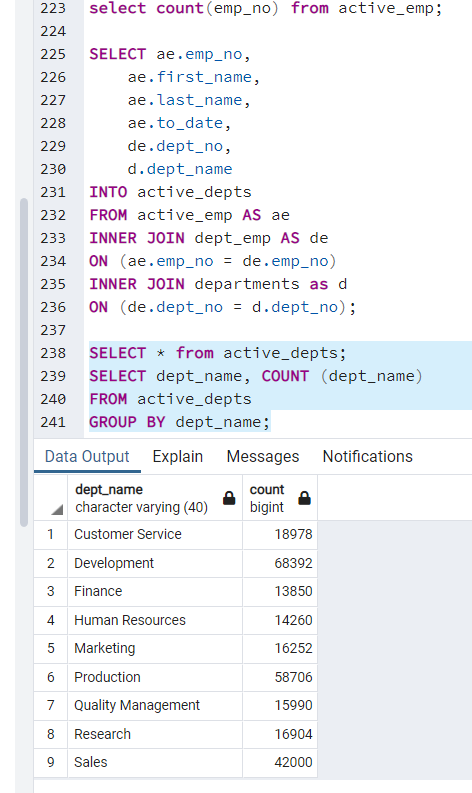

# Pewlett-Hackard-Analysis
Module 7 Challenge: SQL practice

## Overview of the Analysis
The objective of this project was to analyze and update the contents of the employee database for the fictional firm "Pewlett-Hackard." The primary concern was the age of the firm's workforce, in which a considerable number of experienced employees were set to retire. Therefore, much of the analysis revolved around collecting the titles and department roles for employees born between 1952 and 1955, who had worked with the firm starting between 1985 and 1988. Additionally, further consideration was given to retiring managers, as well as to identifying which current employees with birth dates in 1965 would be considered as mentors to help current staff members transition into leadership roles.

## Results
- There are currently 72,458 Pewlett-Hackard employees eligible for retirement based on their starting date and birthdate.

- Pewlett-Hackard has 240,124 current employees. This means that nearly a third of the current workforce is set to retire.

- Among staff eligible for retirement, about 25,000 employees each had the title of Senior Engineer or Senior Staff. Additionally, two Managers are eligible for retirement. 

- The query for eligible mentors returned 1,549 results. The most common titles among eligible mentors are "engineer" and "senior staff." 

## Summary
### Roles in need
The biggest losses appear to be coming from the development and production departments, with over 8000 employees eligible for retirement in each. Sales is also an area of concern, with 5860 eligible employees. Of particular concern, the largest retiring title is Senior Engineer, whereas the eligible mentors more often have the regular Engineer title. 

### Mentorship program
According to the analysis, over 1500 Pewlett-Hackard employess would be eligible to become mentors in the proposed program. While this is a reasonable start to the mentoring program, it would be reasonable to consider broadening the search for eligible mentors to include employees with birth dates in other years near 1965.

### Additional queries
- Excluding the employees set for retirement, the development department has 68,392 active employees, and 435 eligible mentors. The number of available mentors seems insufficient to cover the number of departures from this department.
- Similarly, the production department still retains 58,706 employees, and 356 eligible mentors. This is particularly alarming given the large number of departing employees from this department, and small number of available mentors under the current criteria.

